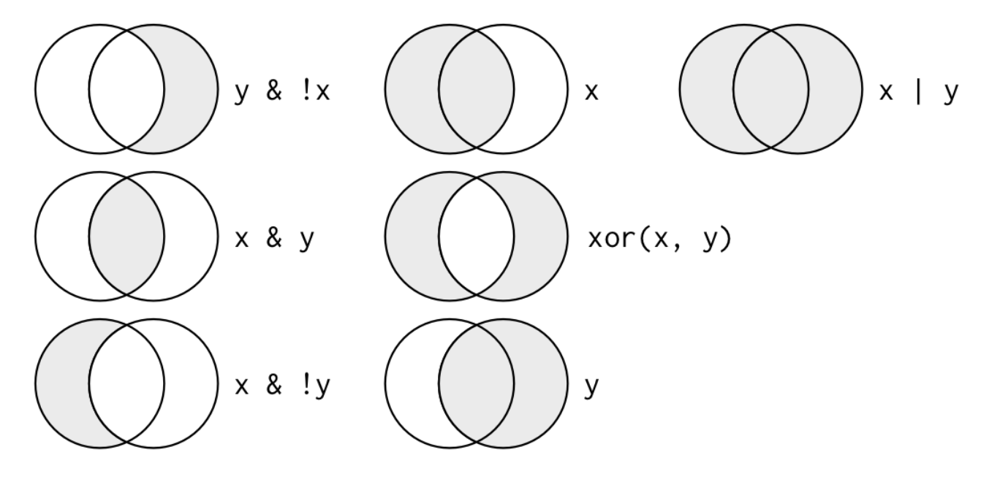

# Introduction
```R
library(nycflights13)
library(tidyverse)
```
The conflicts message printed tells that `dplyr` overwrites some functions in base R. In order to use the base version after loading `dplyr`, you'll need to use their full names: `stars::filter()` and `stats::lag()`.
```R
view(flights) # shows the whole dataset instead of the preview of the first few columns and rows
```

| Letter abbreviation | Meaning                                                                             |
| ------------------- | ----------------------------------------------------------------------------------- |
| `int`               | integer                                                                             |
| `dbl`               | doubles, or real numbers                                                            |
| `chr`               | character vectors                                                                   |
| `dttm`              | date-times                                                                          |
| `lgl`               | logical, vectors that contain only `TRUE`or`FALSE`                                  |
| `fctr`              | factors, which R uses to represent categorical variables with fixed possible values |
| `date`              | dates                                                                               |
## `dplyr` basics
1. `filter()`: pick observations by their values
2. `arrange()`: reorder the rows
3. `select()`: pick variables by their names
4. `mutate()`: create new variables with functions of existing variables
5. `summarize()`: collapse many values down to a single summary
All five functions can be used with `groupby()`, which changes the scope of each function operating on.
All verbs work similarly:
1. The first argument is a data frame.
2. The subsequent arguments describe what to do with the data frame, using the variable names (without quotes).
3. The result is a new data frame.
# `filter()`
`filter()` allows you to subset observations based on their values. The first argument is the name of the data frame. The second and subsequent arguments are the expressions that filter the data frame.
Use the assignment operator `<-`to save the result:
```R
jan1 <- filter(flights, month == 1, day == 1)
```

```R
(jan1 <- filter(flights, month == 1, day == 1)) # save the result into a variable and print it.
```
## Comparisons
```R
>, >=, <, <=, !=, == # comparison operators
```
## Logical Operators

`&`: and  
`|`: or  
`x %in% y` selects every row where `x` is one of the values in`y`.
De Morgan's law: `!(x & y)` is the same as `!x | !y`; `!(x | y)` is the same as `!x & !y`
## Missing Values `NA` (not available)
```R
is.na(x) # determine if a value is missing.
```
`filter()` only includes rows where the condition is `TRUE`; it excludes both `FALSE` and `NA` values.  
Include `NA` in the conditions/arguments if you want to preserve missing values.
# `arrange()`
If provided more than one column name, each additional column will be used to break ties in the values of preceding, columns.

Use `desc()` to reorder by a column in descending order.

Missing values are always sorted in the end.
# `select()`
`starts_with("")`, `ends_with("")`, `contains("")`, `matches("")`, `num_range()`

`everything()` moves the selected column to the start of the data frame.
# `mutate()`
used for add new variables  
to only keep the new variables, use `transmute()`
## Useful Creation Functions
Arithmetic operators: `+, -, *, /, ^`  
Modular arithmetic: `%/%`(integer division) and `%%`(remainder)  
Logs: `log(), log2(), log10()`  
Offsets: `lead(), lag()`  
Cumulative and rolling aggregates: `cumsum(), cumprod(), cummin(), cummax(), cummean()`  
Logical comparisons `<, <=, >, >=, !=`  
Ranking: `min_rank(), row_number(), dense_rank(), percent_rank(), cume_dist(), ntile()`
# `summarize()`
not so useful unless paired with `group_by()`
## Missing Values
`na.rm == True` removes missing values prior to computation
## Useful Summary Functions
`mean(), median()`  
Measures of spread: `sd(), IQR(), mad()` (standard deviation, interquartile range, median absolute deviation)  
Measures of rank: `min(x), quatile(x, 0.25), max(x)`